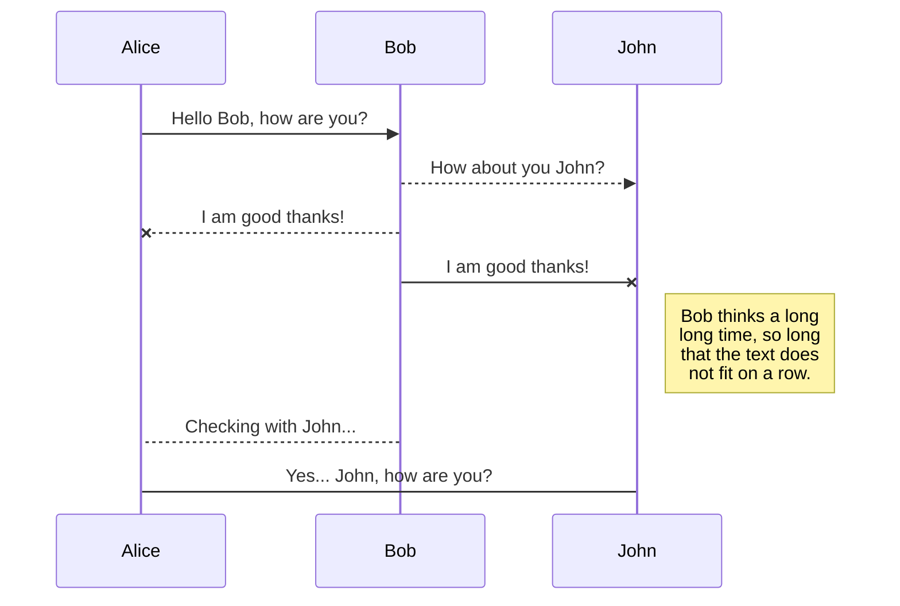
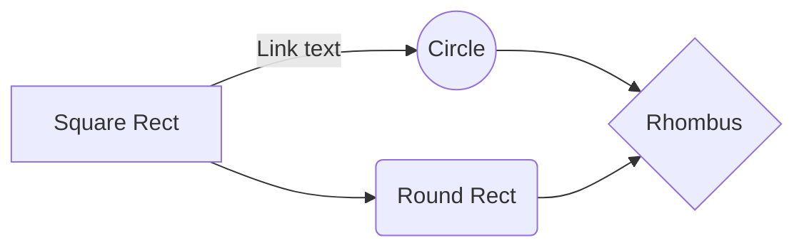

# Bread MVP (Model-View-Presenter)  
  
En el siguiente ejemplo veremos como implementar de manera sencilla los conceptos básicos del patron MVP que hoy en dia esta ganando mucha popularidad entre los Android Devs.  
  
## Resumen  
  
Como parte de cada internship en mi empleo actual se les pide a los nuevos reclutas desarrollar un programa principalmente para uso interno, mismo que nos sirve para medir su conocimiento general y detectar areas de oportunidad, como cada viernes a un compañero le toca el pan para todos, todo hiba bien pero despues de un tiempo empezamos a tener problemas ya sea por olvido, desorden en los turnos o simplemente una mala compra... en fin nace Bread Notification Service  
  
### Requisitos  
```  
Android Studio  
Conocimiento de POO  
Conocimiento básico de control de versiones  
```  
### Instalación  
  
Clonar el repositorio de Bread_MVP y hacer checkout de la rama workshop  
```  
git clone https://github.com/RodryVazquez/Bread_MVP.git  
git checkout workshop  
git status  
```  
### POJO  
```  
public class BreadModel {  
  
    int id;  
    String fullName;  
    String mail;  
    String phoneNumber;  
    String token;  
    int breadIndex;  
    boolean isMyBreadTurn;  
  
    public int getId() {  
        return id;  
    }  
  
    public void setId(int id) {  
        this.id = id;  
    }  
  
    public String getFullName() {  
        return fullName;  
    }  
  
    public void setFullName(String fullName) {  
        this.fullName = fullName;  
    }  
  
    public String getMail() {  
        return mail;  
    }  
  
    public void setMail(String mail) {  
        this.mail = mail;  
    }  
  
    public String getPhoneNumber() {  
        return phoneNumber;  
    }  
  
    public void setPhoneNumber(String phoneNumber) {  
        this.phoneNumber = phoneNumber;  
    }  
  
    public String getToken() {  
        return token;  
    }  
  
    public void setToken(String token) {  
        this.token = token;  
    }  
  
    public int getBreadIndex() {  
        return breadIndex;  
    }  
  
    public void setBreadIndex(int breadIndex) {  
        this.breadIndex = breadIndex;  
    }  
  
    public boolean isMyBreadTurn() {  
        return isMyBreadTurn;  
    }  
  
    public void setMyBreadTurn(boolean myBreadTurn) {  
        isMyBreadTurn = myBreadTurn;  
    }  
}  
```  
### Base View  
```  
void showMessage(String message);  
  
void showOfflineMessage(boolean isCritical);  
  
void showErrorMessage(Throwable throwable);  
  
void showProgress();  
  
void hideProgress();  
```  
### Bread View  
```  
void displayBreadUsers(List<BreadModel> ds);  
```  
### Callbacks para BreadFragment  
  
Una vez creado el contrato con Bread View tendremos que implementar los siguientes callbacks  
```  
    @Override  
    public void onViewCreated(View view, @Nullable Bundle savedInstanceState) {  
        super.onViewCreated(view, savedInstanceState);  
        breadPresenter.setView(this);  
    }  
  
    @Override  
    public void onResume() {  
        super.onResume();  
        breadPresenter.onResume();  
    }  
  
    @Override  
    public void onPause() {  
        super.onPause();  
        breadPresenter.onPause();  
    }  
  
    @Override  
    public void displayBreadUsers(List<BreadModel> ds) {  
        if (ds.size() > 0) {  
            BreadUsersAdapter breadUsersAdapter = new BreadUsersAdapter(getContext(), ds);  
            lstBreadUsers.setAdapter(breadUsersAdapter);  
        }  
    }  
  
    @Override  
    public void showMessage(String message) {  
        Toast.makeText(getContext(), message, Toast.LENGTH_SHORT).show();  
    }  
  
    @Override  
    public void showOfflineMessage(boolean isCritical) {  
        if (isCritical) {  
        }  
    }  
  
    @Override  
    public void showErrorMessage(Throwable throwable) {  
        Log.e(getTag(), throwable.getMessage());  
        Toast.makeText(getContext(), throwable.getMessage(), Toast.LENGTH_SHORT).show();  
    }  
  
    @Override  
    public void showProgress() {  
        refreshLayout.setRefreshing(true);  
    }  
  
    @Override  
    public void hideProgress() {  
        refreshLayout.setRefreshing(false);  
    }  
```  
  
##### Para poder refrescar el contenido del RecyclerView usaremos un swipe refresh  
  
Agregar el listener dentro de onCreateView  
```  
refreshLayout.setOnRefreshListener(new SwipeRefreshLayout.OnRefreshListener() {  
            @Override  
            public void onRefresh() {  
                breadPresenter.onResume();  
            }  
        });  
  
```  
### Adapter  
```  
public class BreadUsersAdapter extends RecyclerView.Adapter<BreadUsersAdapter.ViewHolder> {  
  
    List<BreadModel> ds;  
    Context context;  
  
    public BreadUsersAdapter(Context context, List<BreadModel> ds) {  
        this.context = context;  
        this.ds = ds;  
    }  
  
    @Override  
    public ViewHolder onCreateViewHolder(ViewGroup parent, int viewType) {  
        View root = LayoutInflater.from(context).inflate(R.layout.lst_bread_users_adapter, parent, false);  
        return new ViewHolder(root);  
    }  
  
    @Override  
    public void onBindViewHolder(ViewHolder holder, int position) {  
        BreadModel breadModel = ds.get(position);  
        if (breadModel != null) {  
            holder.txtFullName.setText(breadModel.getFullName());  
            holder.txtEmail.setText(breadModel.getMail());  
            holder.txtPhoneNumber.setText(breadModel.getPhoneNumber());  
            if (breadModel.isMyBreadTurn()) {  
                holder.imgBreadTurn.setImageDrawable(context.getDrawable(R.drawable.ic_check_circle_black_24dp));  
            }  
        }  
    }  
  
    @Override  
    public int getItemCount() {  
        return ds.size();  
    }  
  
    static class ViewHolder extends RecyclerView.ViewHolder {  
  
        @BindView(R.id.fullname)  
        TextView txtFullName;  
        @BindView(R.id.email)  
        TextView txtEmail;  
        @BindView(R.id.phonenumber)  
        TextView txtPhoneNumber;  
        @BindView(R.id.bread_turn)  
        ImageView imgBreadTurn;  
  
        public ViewHolder(View itemView) {  
            super(itemView);  
            ButterKnife.bind(this, itemView);  
        }  
    }  
}  
```  
### LifeCycles Presenter (debatible)  
```  
void onResume();  
void onPause();  
```  
### Bread Presenter  
```  
void setView(BreadView view);  
```  
### Bread Presenter Impl  
```  
public class BreadPresenterImpl implements BreadPresenter {  
  
    private BreadView breadView;  
    BreadRepository breadRepository;  
  
    public BreadPresenterImpl(BreadRepository repository) {  
        this.breadRepository = repository;  
    }  
  
    @Override  
    public void onResume() {  
        fetchBreadUsers();  
    }  
  
    @Override  
    public void onPause() {  
    }  
  
    public void fetchBreadUsers() {  
        this.breadView.showProgress();  
        breadRepository.fetchBreadUsers(new ApiCallback<BreadModel>() {  
            @Override  
            public void onSuccess(List<BreadModel> ds) {  
                breadView.displayBreadUsers(ds);  
                breadView.hideProgress();  
            }  
  
            @Override  
            public void onError(Throwable t) {  
                breadView.showErrorMessage(t);  
                breadView.hideProgress();  
            }  
  
            @Override  
            public void onGenericMessage(String message) {  
                breadView.showMessage(message);  
                breadView.hideProgress();  
            }  
        });  
    }  
  
    @Override  
    public void setView(BreadView view) {  
        this.breadView = view;  
    }  
```  
* [Bread Notification Service](https://breadnotificationservice.azurewebsites.net/) - Proyecto web para la administración de usuarios y tiendas  
* [Dagger 2](https://google.github.io/dagger/) - Inyección de dependencias  
* [Butterknife](http://jakewharton.github.io/butterknife/) - Inyección de vistas  
* [RDP](https://martinfowler.com/eaaCatalog/repository.html) - Patrón repositorio  
* [Passive View](https://martinfowler.com/eaaDev/PassiveScreen.html) - Documentación acerca de passive view  
* [MVP](https://en.wikipedia.org/wiki/Model%E2%80%93view%E2%80%93presenter) - Model-View-Presenter  
* [Unit Test](http://site.mockito.org/) - Mockito  
* [Unit Test](http://robolectric.org/) - Roboelectric

## UML diagrams

You can render UML diagrams using [Mermaid](https://mermaidjs.github.io/). For example, this will produce a sequence diagram:



And this will produce a flow chart:

